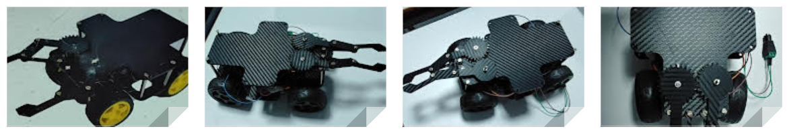
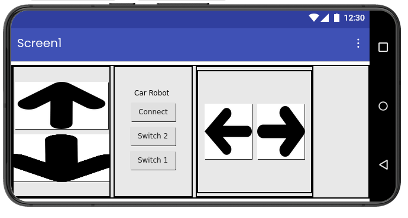

# 🤖 Bluetooth Arduino Robot Car

A Bluetooth-controlled robot car developed using **MIT App Inventor** and **Arduino UNO**.  
The robot can move in multiple directions using mobile commands and also includes a **servo-based gripper mechanism** to grab and release objects.

  

  

  

---

## 📱 Features

- Forward movement
- Backward movement
- Left turn
- Right turn
- Stop control
- Bluetooth communication using HC-05 / HC-06
- Servo motor gripper control
- Object grab and release functionality
- Real-time wireless robot control

  

---

## 🛠️ Built With

### Mobile App
- MIT App Inventor
- Android

### Hardware
- Arduino UNO
- HW-130 / L293D Motor Driver Shield
- HC-05 Bluetooth Module
- Servo Motor
- DC Motors
- Battery Pack

---

## 🚀 How It Works

1. Connect the mobile app to the HC-05 Bluetooth module
2. Use control buttons in the app:
   - **F** → Forward
   - **B** → Backward
   - **L** → Left
   - **R** → Right
   - **S** → Stop
3. Use:
   - **O** → Open gripper
   - **G** → Close gripper
4. Commands are sent wirelessly to Arduino through Bluetooth

---

## 📚 Learning Objectives

- Bluetooth communication with Arduino
- Mobile app development using MIT App Inventor
- Robot motion control
- Servo motor interfacing
- Wireless embedded systems
- Event-driven programming

---

## 📦 Applications

- Pick and place robots
- Educational robotics
- Bluetooth-controlled vehicles
- Embedded systems learning
- Automation projects

---
