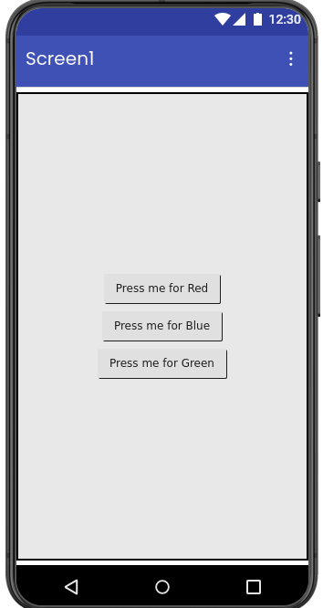
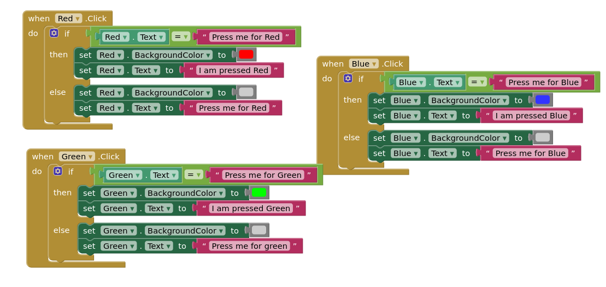

# 🎨 Color Changing Buttons App

A simple interactive Android application developed using **MIT App Inventor**.  
The app demonstrates dynamic button color and text changes based on user interaction.

<div align="center">
  
</div>

---

## 📱 Features

- 🔴 Red button interaction
- 🔵 Blue button interaction
- 🟢 Green button interaction
- Dynamic text updates
- Button color changes on press
- Restores default state on release
- Beginner-friendly UI design

<div align="center">
  
</div>

---

## 🛠️ Built With

- MIT App Inventor
- Android

---

## 🚀 How It Works

### 🔴 Button 1
- On Press:
  - Button color changes to **Red**
  - Text changes to:
    ```text
    I am pressed
    ```
- On Release:
  - Button returns to default color
  - Text changes to:
    ```text
    Press me for Red
    ```

### 🔵 Button 2
- On Press:
  - Button color changes to **Blue**
  - Text changes to:
    ```text
    I am pressed
    ```
- On Release:
  - Button returns to default color
  - Text changes to:
    ```text
    Press me for Blue
    ```

### 🟢 Button 3
- On Press:
  - Button color changes to **Green**
  - Text changes to:
    ```text
    I am pressed
    ```
- On Release:
  - Button returns to default color
  - Text changes to:
    ```text
    Press me for Green
    ```

---

## 📚 Learning Objectives

- Understanding button events
- Dynamic UI updates
- Changing button properties
- Event-driven programming
- Beginner Android app development

---

## 📦 Applications

- UI interaction demos
- Beginner programming projects
- Event handling practice
- Educational mobile apps

---

## 👨‍💻 Author

**Pulkit Garg**

---