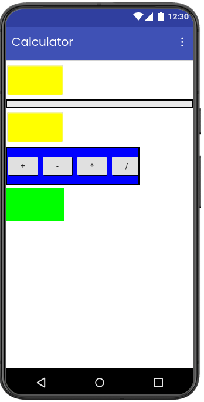

# 🔢 Calculator App

A simple and beginner-friendly calculator application developed using **MIT App Inventor**.  
This app performs basic arithmetic operations with an easy-to-use mobile interface.

  

---

## 📱 Features

- Addition
- Subtraction
- Multiplication
- Division
- Clear button functionality
- Simple and clean UI

  

---

## 🛠️ Built With

- MIT App Inventor
- Android

---

## 🚀 How It Works

1. Enter two numbers
2. Select the required operation
3. View the calculated result instantly

---

## 📚 Learning Objectives

- Understanding UI components in MIT App Inventor
- Working with buttons and labels
- Performing arithmetic logic
- Event-driven programming

---