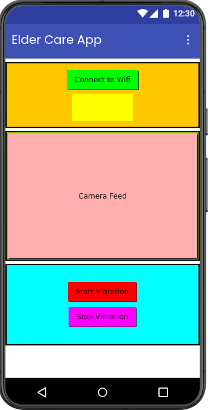
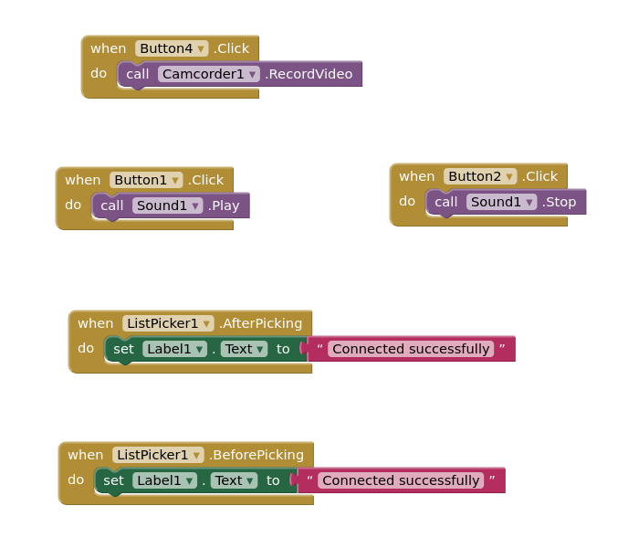

# 👴 Eldercare Monitoring App

An Android-based eldercare assistance application developed using **MIT App Inventor**.  
The app helps caregivers monitor elderly individuals remotely through live camera streaming, WiFi connectivity, and fall alert vibration controls.

  

---

## 📱 Features

- 📶 WiFi connection button
- 📷 Live camera feed viewing
- 🚨 Fall detection alert support
- 📳 Start vibration alert
- 🔕 Stop vibration alert
- Simple and accessible user interface
- Real-time monitoring support

  

---

## 🛠️ Built With

### Mobile Application
- MIT App Inventor
- Android

### Hardware / Embedded System
- Raspberry Pi 4
- Camera Module
- WiFi Communication
- Embedded Sensors & Alert System

---

## 🚀 How It Works

1. Connect the application to the monitoring system using the **WiFi** button
2. Use the **Camera Feed** button to access the live video stream
3. When a fall is detected:
   - The system triggers a vibration alert
4. Use:
   - **Start Vibration** to enable alerts
   - **Stop Vibration** to disable alerts

---

## 📚 Learning Objectives

- IoT-based healthcare monitoring
- WiFi communication
- Mobile app interaction with embedded systems
- Real-time video streaming
- Alert and notification systems
- Human safety monitoring applications

---

## 📦 Applications

- Elderly safety monitoring
- Smart healthcare systems
- Remote caregiving
- IoT healthcare projects
- Fall detection assistance systems

---

## 👨‍💻 Author

**Pulkit Garg**

---