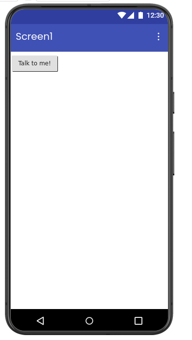
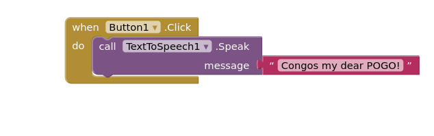

# 🔊 Text To Speech App

A simple Android application developed using **MIT App Inventor** that converts typed text into spoken audio using the device’s built-in Text-to-Speech engine.

  

---

## 📱 Features

- Convert text into speech
- Easy-to-use interface
- Real-time voice output
- Clear text input option
- Uses mobile Text-to-Speech engine

  

---

## 🛠️ Built With

- MIT App Inventor
- Android Text-to-Speech Engine

---

## 🚀 How It Works

1. Enter text in the input field
2. Press the **Speak** button
3. The app converts the text into voice output

---

## 📚 Learning Objectives

- Understanding text input components
- Using Text-to-Speech functionality
- Working with buttons and events
- Mobile accessibility features
- App interaction design

---

## 📦 Applications

- Accessibility tools
- Voice assistants
- Learning applications
- Communication support systems

---
