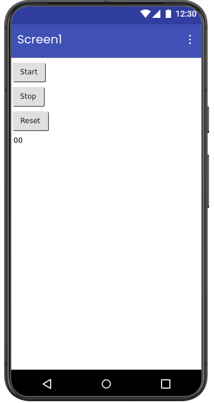
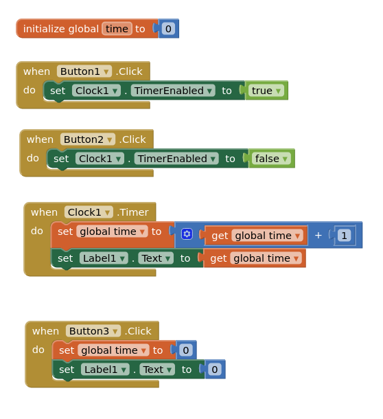

# ⏱️ Timer App

A simple timer application developed using **MIT App Inventor**.  
The app demonstrates timer functionality using Start, Stop, and Reset controls with real-time second increments.

<div align="center">
  
</div>

---

## 📱 Features

- ▶️ Start timer
- ⏸️ Stop timer
- 🔄 Reset timer
- Real-time timer updates
- Timer starts from `0`
- Time increments by `1 second`
- Simple and beginner-friendly interface

<div align="center">
  
</div>

---

## 🛠️ Built With

- MIT App Inventor
- Android

---

## 🚀 How It Works

### ▶️ Start Button
- Starts the timer from `0`
- Time increases continuously in `1-second` intervals

### ⏸️ Stop Button
- Stops the running timer
- Preserves the current timer value

### 🔄 Reset Button
- Resets the timer value back to:
  ```text
  0
  ```

---

## 📚 Learning Objectives

- Understanding timers and clock components
- Event-driven programming
- Updating labels dynamically
- Working with button controls
- Basic app logic implementation

---

## 📦 Applications

- Stopwatch applications
- Productivity tools
- Workout timers
- Educational beginner projects

---
