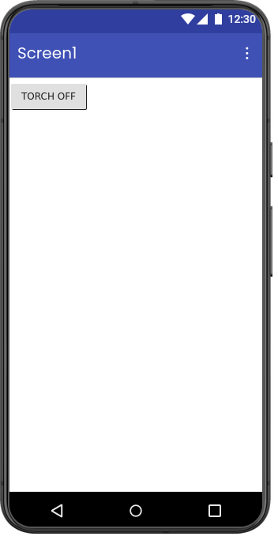
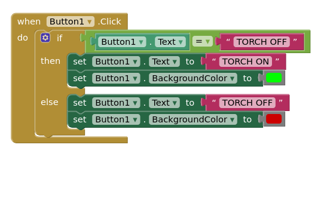

# 🔦 Torch / Flashlight App

A simple Android flashlight application developed using **MIT App Inventor**.  
The app allows users to turn the mobile flashlight ON and OFF using a single button with dynamic color indication.

  

---

## 📱 Features

- Turn flashlight ON
- Turn flashlight OFF
- Button changes to **Green** when flashlight is ON
- Button changes to **Red** when flashlight is OFF
- Simple and user-friendly interface

  

---

## 🛠️ Built With

- MIT App Inventor
- Android Flashlight/Torch Component

---

## 🚀 How It Works

1. Open the app
2. Press the button to turn ON the flashlight
3. Button color changes to **Green**
4. Press again to turn OFF the flashlight
5. Button color changes to **Red**

---

## 📚 Learning Objectives

- Understanding button components
- Using mobile hardware features
- Working with conditional logic
- Changing UI colors dynamically
- Event-driven programming

---

## 📦 Applications

- Emergency flashlight
- Mobile utility tools
- Beginner Android projects
- Hardware interaction learning

---
